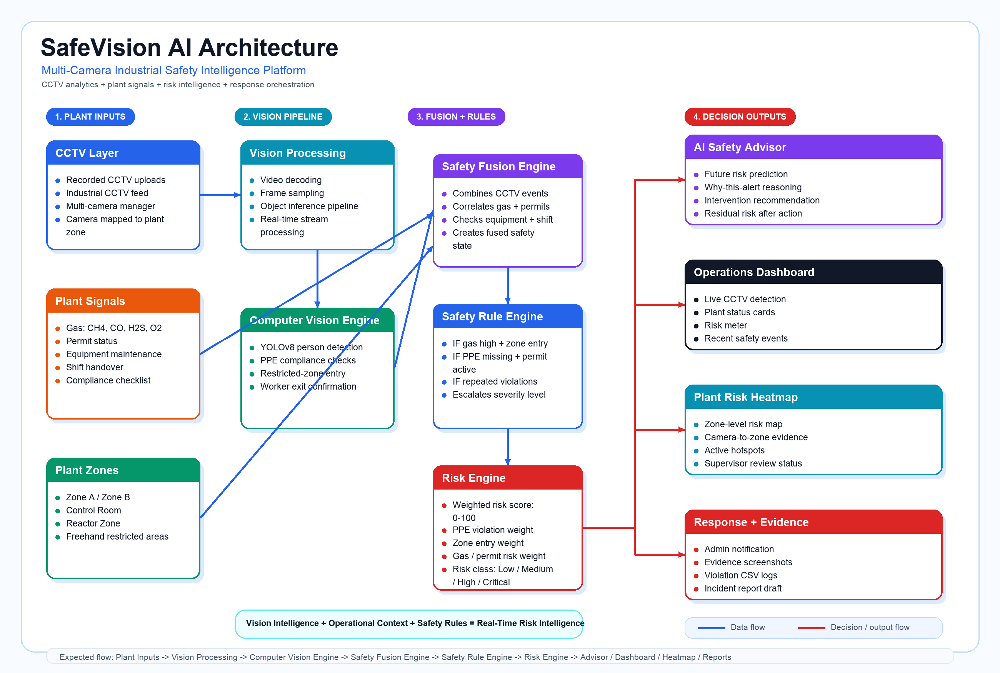
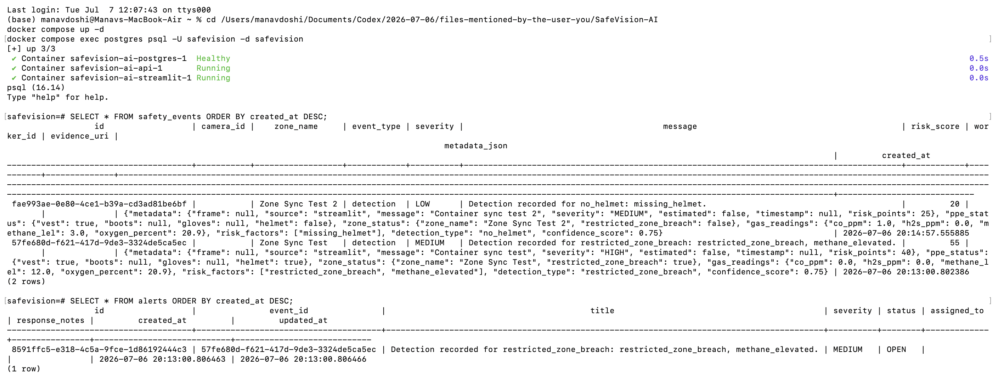

# SafeVision AI

[](https://github.com/manav252/SafeVision-AI/actions/workflows/ci.yml)


SafeVision AI is an industrial safety intelligence platform that combines CCTV analytics with plant context such as gas readings, work permits, equipment status, shift handover notes, restricted zones, and compliance checklist state.

**Live Demo:** [safevision-ai-manav25.streamlit.app](https://safevision-ai-manav25.streamlit.app)

The repository includes two demo surfaces:

- **Website demo:** React + Vite landing page for Vercel deployment.
- **Live operations dashboard:** Streamlit app with video upload, zone drawing, YOLO/OpenCV detection, risk fusion, AI Safety Advisor, heatmap, evidence capture, and incident logs.

## What It Solves

Industrial sites often run CCTV, gas detectors, permit systems, and compliance workflows separately. SafeVision AI fuses those signals so a safety officer can see compound risk before it becomes an incident.

Example:

```text
Worker near restricted zone
+ PPE warning
+ elevated gas
+ active maintenance permit
= high-priority supervisor action
```

## Core Features

- Multi-camera CCTV manager for uploaded plant feeds.
- YOLOv8/OpenCV based person and PPE detection.
- Custom PPE model support at `models/ppe_yolov8.pt`.
- Fallback PPE estimation when a custom model is unavailable.
- Freehand and preset restricted-zone monitoring.
- Plant signal inputs for gas, permits, equipment, shift handover, compliance, and emergency state.
- Weighted risk score from 0 to 100.
- AI Safety Advisor with reasoned recommendations.
- Explain-this-alert workflow for demo explainability.
- Plant Risk Heatmap showing zone-level risk.
- Evidence screenshots and CSV logs.
- FastAPI backend with authentication, events, alerts, detection intake, reports, dashboard summary, and heatmap APIs.
- Streamlit-to-FastAPI sync for storing demo safety events in PostgreSQL.
- Docker and GitHub Actions support.

## Tech Stack

**Frontend website:** React, Vite, Tailwind CSS, Framer Motion  
**Live dashboard:** Streamlit, streamlit-drawable-canvas, OpenCV, Ultralytics YOLOv8, NumPy, Pandas, Pillow  
**Backend scaffold:** FastAPI, SQLAlchemy, PostgreSQL, JWT auth  
**Deployment:** Vercel for the website, Docker/Streamlit for the live dashboard

## System Architecture



SafeVision AI separates the live demo, backend API, and database layers so the dashboard stays interactive while FastAPI handles persistence and API access.

## Repository Structure

```text
SafeVision-AI/
├── src/                       # React/Vite landing page
├── app.py                     # Streamlit operations dashboard
├── detector.py                # YOLO loading, inference, PPE fallback logic
├── risk_engine.py             # Risk score and safety event generation
├── utils.py                   # Drawing, geometry, evidence, CSV utilities
├── backend/                   # FastAPI enterprise API scaffold
├── database/schema.sql        # PostgreSQL schema
├── docs/                      # Architecture, API, deployment docs
├── assets/                    # Architecture diagram and landing assets
├── models/                    # YOLO model files
├── sample_videos/             # Demo CCTV footage
├── requirements.txt           # Streamlit/Python dependencies
├── requirements-backend.txt   # FastAPI/backend dependencies
├── requirements-dev.txt       # Backend test dependencies
├── package.json               # React/Vite dependencies
├── Dockerfile
├── Dockerfile.streamlit
├── docker-compose.yml
└── vercel.json
```

## Run Website Locally

```bash
npm install
npm run dev
```

Open the Vite URL shown in the terminal.

## Run Live Dashboard Locally

```bash
python3 -m venv .venv
source .venv/bin/activate
python -m pip install --upgrade pip
pip install -r requirements.txt
streamlit run app.py
```

## Run Backend Locally

```bash
python3 -m venv .venv
source .venv/bin/activate
pip install -r requirements-backend.txt
cp .env.example .env
uvicorn backend.app.main:app --reload
```

Open `http://localhost:8000/docs`.

## Deploy Website To Vercel

This repo is already configured for Vercel.

- Framework preset: `Vite`
- Build command: `npm run build`
- Output directory: `dist`

Import the GitHub repo into Vercel and deploy. The landing page can link users into the live dashboard demo flow.

## Docker Demo

```bash
cp .env.example .env
docker compose up --build
```

Open:

- Streamlit dashboard: `http://localhost:8501`
- FastAPI backend: `http://localhost:8000`
- API docs: `http://localhost:8000/docs`

## Data Storage and PostgreSQL

SafeVision AI uses PostgreSQL through Docker Compose for backend data. The Streamlit dashboard does not write directly to the database. Instead, detected safety events are sent through FastAPI and then stored in PostgreSQL.

```text
Streamlit dashboard -> FastAPI detection API -> PostgreSQL
```

Automatically stored in PostgreSQL:

- detection events
- safety events
- alerts
- risk scores
- PPE status
- gas readings
- zone status
- dashboard/report source data

Uploaded video files are not stored in GitHub or PostgreSQL. For local/Docker runs they are saved on disk under:

```text
outputs/uploads/
```

The `outputs/` directory is ignored by Git because uploaded videos, evidence frames, and generated logs can become large. If the app is running on Streamlit Cloud, uploaded files live only on Streamlit Cloud's temporary filesystem for that app session.

To inspect PostgreSQL from your terminal:

```bash
cd /Users/manavdoshi/Documents/Codex/2026-07-06/files-mentioned-by-the-user-you/SafeVision-AI
docker compose up -d
docker compose exec postgres psql -U safevision -d safevision
```

After the prompt changes to `safevision=#`, run SQL such as:

```sql
SELECT * FROM safety_events ORDER BY created_at DESC;
SELECT * FROM alerts ORDER BY created_at DESC;
```

For a cleaner terminal view, select only the most useful columns:

```sql
SELECT zone_name, event_type, severity, risk_score, created_at
FROM safety_events
ORDER BY created_at DESC;

SELECT title, severity, status, created_at
FROM alerts
ORDER BY created_at DESC;
```

Example PostgreSQL verification after a Streamlit detection sync:

```text
safety_events
zone_name        | event_type | severity | risk_score | created_at
-----------------+------------+----------+------------+----------------------------
Zone Sync Test 2 | detection  | LOW      | 20         | 2026-07-06 20:14:57.555885
Zone Sync Test   | detection  | MEDIUM   | 55         | 2026-07-06 20:13:00.802386

alerts
title                                                                    | severity | status | created_at
-------------------------------------------------------------------------+----------+--------+----------------------------
Detection recorded for restricted_zone_breach: restricted_zone_breach... | MEDIUM   | OPEN   | 2026-07-06 20:13:00.806463
```

Exit PostgreSQL with:

```sql
\q
```

Downloading an incident report from the Streamlit UI is optional. Detection data is synced automatically when the backend is running and `SAFEVISION_BACKEND_SYNC=true`. The download button only saves a report file to your computer.



## API Overview

| Endpoint | Purpose |
| --- | --- |
| `/api/v1/auth` | Register users and log in with JWT authentication |
| `/api/v1/events` | Create and list safety events |
| `/api/v1/alerts` | List, acknowledge, and manage safety alerts |
| `/api/v1/detection` | Submit detection metadata, PPE status, gas readings, zone status, confidence, and risk score |
| `/api/v1/reports` | Generate export-ready safety report JSON and event/alert summaries |
| `/api/v1/dashboard` | Return dashboard summary data such as totals, active alerts, risk distribution, incidents, and heatmap summary |
| `/api/v1/heatmap` | Return risk heatmap data for plant zones |
| `/api/v1/health` | API health check |

## API and Documentation

- API examples: [docs/api.md](docs/api.md)
- Quickstart: [docs/quickstart.md](docs/quickstart.md)
- Docker guide: [docs/docker.md](docs/docker.md)
- Architecture: [docs/architecture.md](docs/architecture.md)
- Model card: [docs/model_card.md](docs/model_card.md)
- Changelog: [CHANGELOG.md](CHANGELOG.md)
- Implementation summary: [IMPLEMENTATION_SUMMARY.md](IMPLEMENTATION_SUMMARY.md)

Recommended GitHub topics: `computer-vision`, `fastapi`, `streamlit`, `industrial-safety`, `yolov8`, `ppe-detection`, `ai-safety`, `postgresql`, `react`, `docker`.

## Security Setup

The backend requires `JWT_SECRET_KEY` from the environment. Use a unique 32+ character value before running FastAPI or Docker Compose. Keep `.env` out of version control and use managed secrets in production.

For local development, copy `.env.example` to `.env` and replace placeholder values.

## Tests

```bash
pip install -r requirements-dev.txt
JWT_SECRET_KEY=test-secret-key-for-safevision-ai-32-chars pytest
```

## Demo Flow

1. Open the SafeVision AI landing page.
2. Click **Launch Live Dashboard**.
3. Upload one or more CCTV clips or use the industrial demo feed.
4. Draw restricted zones for plant areas.
5. Select plant context such as elevated gas and active permit.
6. Start monitoring.
7. Show live detection, risk score, recent safety events, AI Safety Advisor, heatmap, and incident report.

## Production Notes

- Replace fallback PPE estimation with a site-trained model at `models/ppe_yolov8.pt`.
- Validate model performance with a documented holdout dataset before operational use.
- Connect gas readings to PLC, SCADA, MQTT, OPC-UA, or historian APIs.
- Store evidence in object storage for production.
- Use managed PostgreSQL and secure JWT configuration.
- Add real alert channels such as email, SMS, WhatsApp, Teams, or plant siren integration.

## Resume Bullets

- Built an industrial safety intelligence platform combining YOLOv8 computer vision with gas, permit, equipment, shift, and compliance context.
- Implemented restricted-zone monitoring, PPE violation detection, weighted risk scoring, and explainable safety recommendations.
- Designed a Vercel-ready React landing page and a Streamlit operations dashboard with evidence capture and CSV incident logs.
- Added FastAPI/PostgreSQL enterprise scaffolding with authentication, alert/event APIs, Docker support, and deployment documentation.

## License

MIT License. See [LICENSE](LICENSE).
