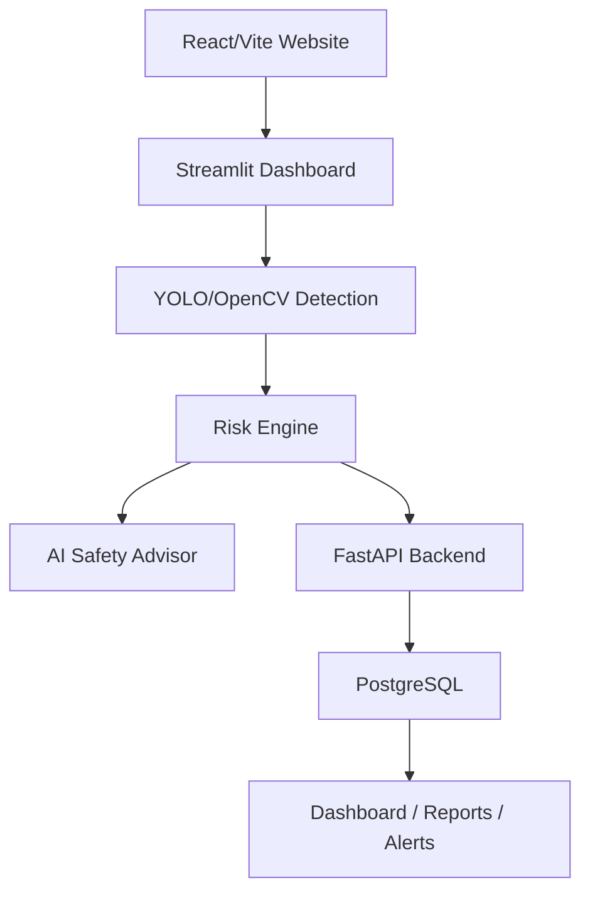
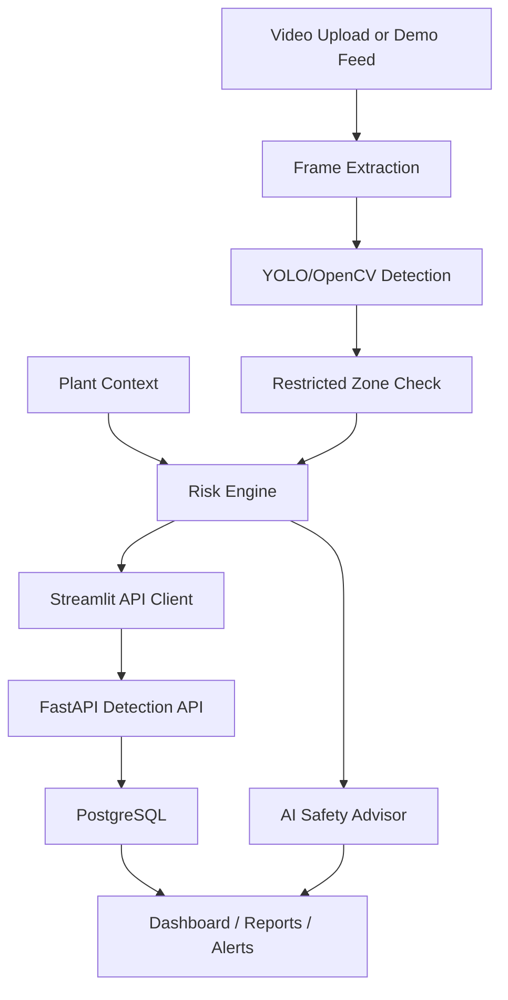
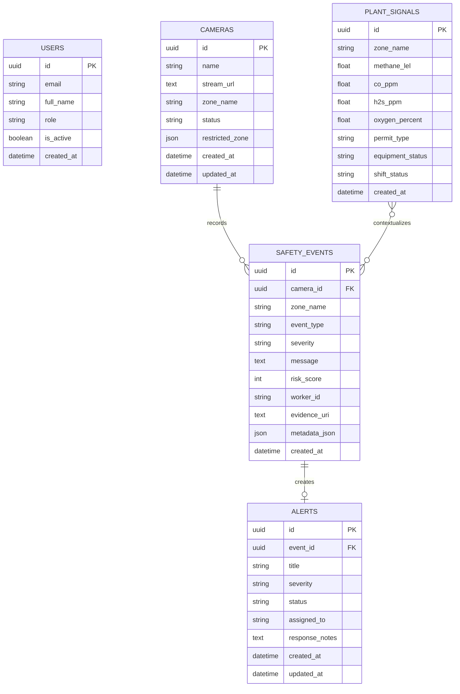
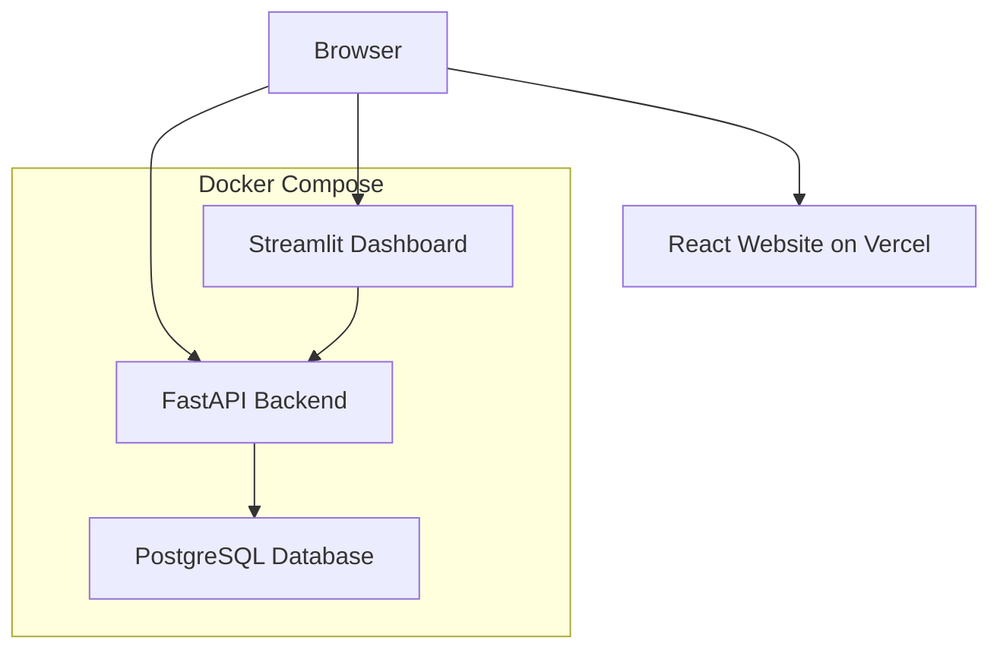

# SafeVision AI Architecture

SafeVision AI is structured as a portfolio-ready industrial safety prototype with a React/Vite website, Streamlit live dashboard, YOLO/OpenCV detection layer, risk engine, FastAPI backend, and PostgreSQL persistence.

## Current System Architecture

## Component Responsibilities

| Component | Responsibility |
| --- | --- |
| `src/` | React/Vite website used as the project landing page and Vercel deploy target. |
| `app.py` | Streamlit operations dashboard for video upload, camera setup, zone drawing, monitoring, advisor UI, heatmap, and report drafting. |
| `detector.py` | YOLOv8/Ultralytics model loading, frame inference, PPE class parsing, and fallback detection behavior. |
| `risk_engine.py` | Weighted risk scoring and safety event generation for PPE, restricted zones, gas context, permits, equipment, shift state, and emergency context. |
| `safevision_api_client.py` | Streamlit-to-FastAPI client that syncs newly detected violation rows into the backend. |
| `backend/app/` | FastAPI backend with authentication, events, alerts, detection intake, reports, dashboard summary, and heatmap APIs. |
| `backend/app/models.py` | SQLAlchemy models for users, cameras, safety events, alerts, and plant signals. |
| PostgreSQL | Stores users, cameras, safety events, alerts, plant signals, detection metadata embedded in events, and report source data. |
| Docker Compose | Runs PostgreSQL, FastAPI, and Streamlit together for local full-stack demos. |

## Detection and Persistence Flow

## Backend API Surface

| API Area | Purpose |
| --- | --- |
| `/api/v1/auth` | Register users and issue JWT access tokens. |
| `/api/v1/events` | Create and list safety events. |
| `/api/v1/alerts` | List and acknowledge generated alerts. |
| `/api/v1/detection` | Accept detection metadata, PPE state, gas readings, zone state, confidence, and calculated risk context. |
| `/api/v1/reports` | Generate export-ready report JSON from stored events and alerts. |
| `/api/v1/dashboard` | Return dashboard totals, active alerts, risk distribution, recent incidents, and heatmap summary. |
| `/api/v1/heatmap` | Return zone-level heatmap data. |
| `/api/v1/health` | Report API health. |

## Data Model Notes

The current implementation persists detection results as `safety_events` with detailed detection payloads in `metadata_json`. Alerts are generated from safety events. Reports are generated as export-ready JSON from stored events and alerts rather than saved as separate report files.

## Deployment View

## Current Limitations

- Gas readings and plant signals are demo inputs unless connected to real plant systems.
- The PPE model is a Roboflow-exported pretrained YOLOv8 model and has not been fine-tuned in this repository.
- Formal model evaluation metrics are not claimed in this project.
- PostgreSQL stores backend event and alert data; uploaded video files remain file-based under `outputs/uploads/` for local runs.
- The system is a prototype and is not certified for production industrial safety decisions.

## Future Work

- Fine-tune and evaluate PPE detection on representative industrial datasets.
- Connect live gas detector, SCADA, historian, and permit-to-work APIs.
- Add cloud object storage for video/evidence retention.
- Add Alembic migrations for production-grade database evolution.
- Add role-based review workflows and real notification channels.
