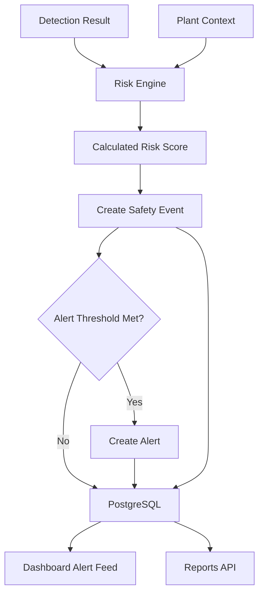

# Alert Generation Flow

```mermaid
flowchart TD
    detection["Detection Result"]
    context["Plant Context"]
    risk["Risk Engine"]
    score["Calculated Risk Score"]
    event["Create Safety Event"]
    threshold{"Alert Threshold Met?"}
    alert["Create Alert"]
    db["PostgreSQL"]
    dashboard["Dashboard Alert Feed"]
    reports["Reports API"]

    detection --> risk
    context --> risk
    risk --> score
    score --> event
    event --> threshold
    threshold -- "Yes" --> alert
    threshold -- "No" --> db
    alert --> db
    event --> db
    db --> dashboard
    db --> reports
```
