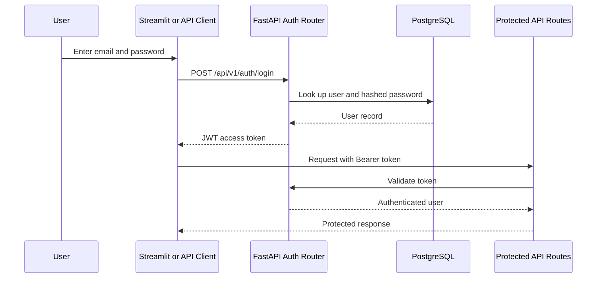

# Authentication Flow

```mermaid
sequenceDiagram
    participant User
    participant Client as Streamlit or API Client
    participant Auth as FastAPI Auth Router
    participant DB as PostgreSQL
    participant API as Protected API Routes

    User->>Client: Enter email and password
    Client->>Auth: POST /api/v1/auth/login
    Auth->>DB: Look up user and hashed password
    DB-->>Auth: User record
    Auth-->>Client: JWT access token
    Client->>API: Request with Bearer token
    API->>Auth: Validate token
    Auth-->>API: Authenticated user
    API-->>Client: Protected response
```
