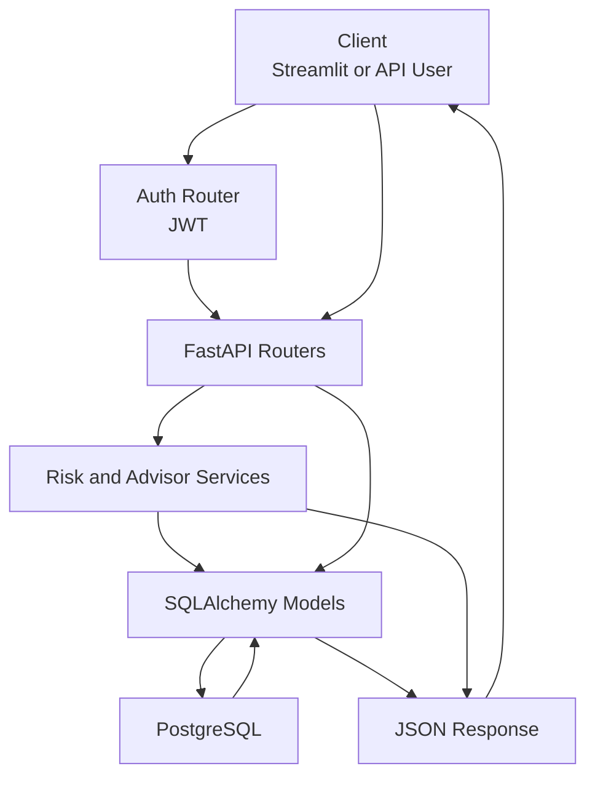

# Backend API Flow

```mermaid
flowchart TD
    client["Client<br/>Streamlit or API User"]
    auth["Auth Router<br/>JWT"]
    routes["FastAPI Routers"]
    services["Risk and Advisor Services"]
    models["SQLAlchemy Models"]
    db["PostgreSQL"]
    response["JSON Response"]

    client --> auth
    auth --> routes
    client --> routes
    routes --> services
    services --> models
    routes --> models
    models --> db
    db --> models
    models --> response
    services --> response
    response --> client
```
