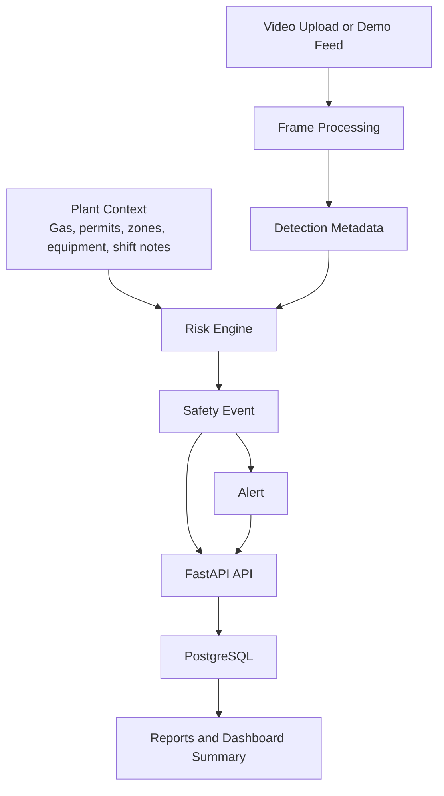

# Data Flow Architecture

```mermaid
flowchart TD
    upload["Video Upload or Demo Feed"]
    frames["Frame Processing"]
    detections["Detection Metadata"]
    context["Plant Context<br/>Gas, permits, zones, equipment, shift notes"]
    risk["Risk Engine"]
    event["Safety Event"]
    alert["Alert"]
    api["FastAPI API"]
    db["PostgreSQL"]
    reports["Reports and Dashboard Summary"]

    upload --> frames
    frames --> detections
    context --> risk
    detections --> risk
    risk --> event
    event --> alert
    event --> api
    alert --> api
    api --> db
    db --> reports
```
