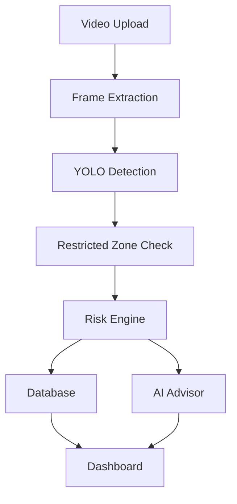

# Detection Pipeline

```mermaid
flowchart TD
    video["Video Upload"]
    frames["Frame Extraction"]
    yolo["YOLO Detection"]
    zone["Restricted Zone Check"]
    risk["Risk Engine"]
    advisor["AI Advisor"]
    database["Database"]
    dashboard["Dashboard"]

    video --> frames
    frames --> yolo
    yolo --> zone
    zone --> risk
    risk --> advisor
    risk --> database
    database --> dashboard
    advisor --> dashboard
```
