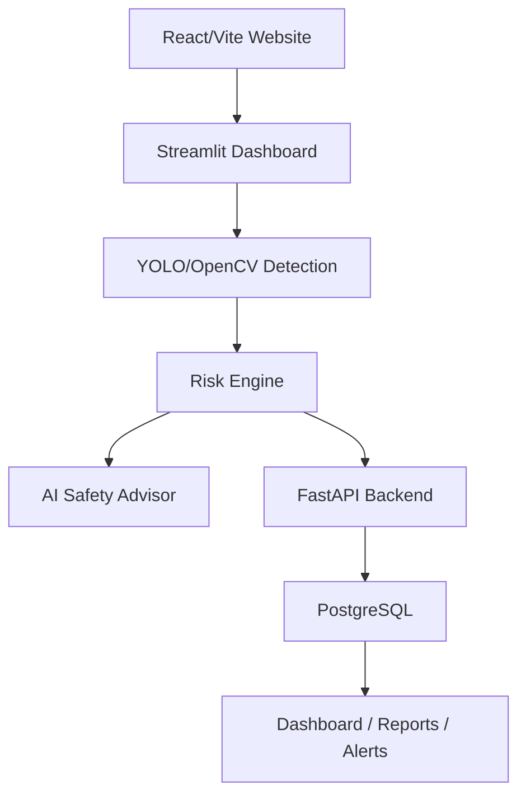

# Overall System Architecture

```mermaid
flowchart TD
    react["React/Vite Website"]
    streamlit["Streamlit Dashboard"]
    detection["YOLO/OpenCV Detection"]
    risk["Risk Engine"]
    advisor["AI Safety Advisor"]
    backend["FastAPI Backend"]
    postgres["PostgreSQL"]
    outputs["Dashboard / Reports / Alerts"]

    react --> streamlit
    streamlit --> detection
    detection --> risk
    risk --> advisor
    risk --> backend
    backend --> postgres
    postgres --> outputs
```
