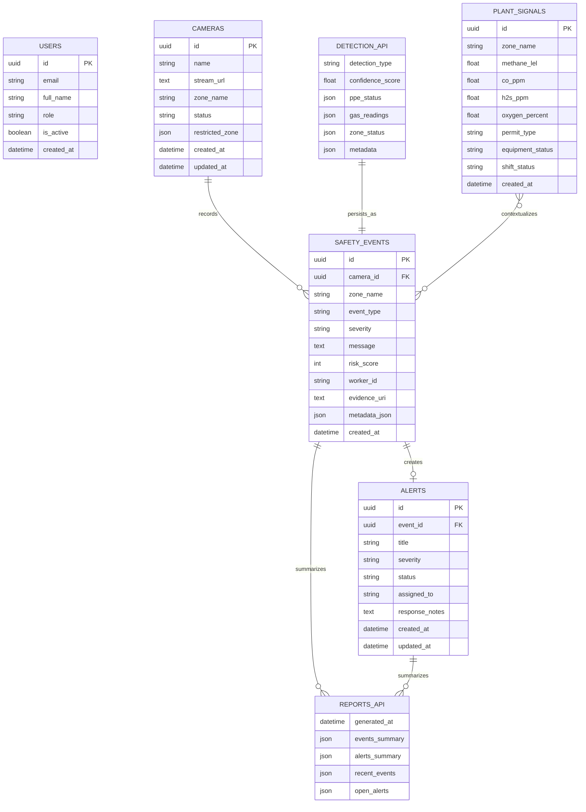

# PostgreSQL Entity Relationship Diagram

```mermaid
erDiagram
    USERS {
        uuid id PK
        string email
        string full_name
        string role
        boolean is_active
        datetime created_at
    }

    CAMERAS {
        uuid id PK
        string name
        text stream_url
        string zone_name
        string status
        json restricted_zone
        datetime created_at
        datetime updated_at
    }

    SAFETY_EVENTS {
        uuid id PK
        uuid camera_id FK
        string zone_name
        string event_type
        string severity
        text message
        int risk_score
        string worker_id
        text evidence_uri
        json metadata_json
        datetime created_at
    }

    ALERTS {
        uuid id PK
        uuid event_id FK
        string title
        string severity
        string status
        string assigned_to
        text response_notes
        datetime created_at
        datetime updated_at
    }

    PLANT_SIGNALS {
        uuid id PK
        string zone_name
        float methane_lel
        float co_ppm
        float h2s_ppm
        float oxygen_percent
        string permit_type
        string equipment_status
        string shift_status
        datetime created_at
    }

    DETECTION_API {
        string detection_type
        float confidence_score
        json ppe_status
        json gas_readings
        json zone_status
        json metadata
    }

    REPORTS_API {
        datetime generated_at
        json events_summary
        json alerts_summary
        json recent_events
        json open_alerts
    }

    CAMERAS ||--o{ SAFETY_EVENTS : records
    SAFETY_EVENTS ||--o| ALERTS : creates
    DETECTION_API ||--|| SAFETY_EVENTS : persists_as
    SAFETY_EVENTS ||--o{ REPORTS_API : summarizes
    ALERTS ||--o{ REPORTS_API : summarizes
    PLANT_SIGNALS }o--o{ SAFETY_EVENTS : contextualizes
```
